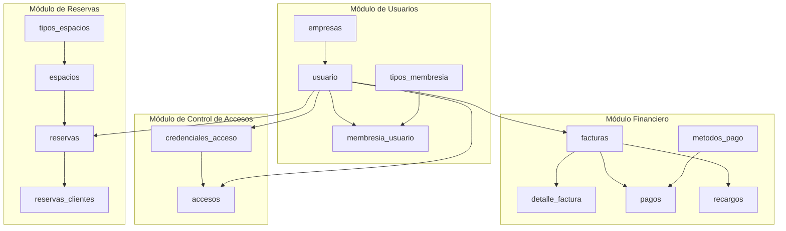

# 🏢 Sistema de Gestión de Coworking - Proyecto "Tienda de disfraces"

Bienvenido al repositorio oficial del **Sistema de Gestión de Coworking (referenciado bajo el nombre clave "Tienda de disfraces")**. Este sistema implementa una base de datos robusta, relacional y altamente automatizada en MySQL para administrar la operación diaria, el control de acceso físico y las finanzas de una red de espacios de trabajo compartido.

---

## 📝 1. Descripción del Proyecto

El propósito de esta base de datos es centralizar y automatizar todas las actividades operativas de un ecosistema de coworking. Proporciona una solución escalable y segura para la administración de clientes individuales y corporativos, la contratación de planes de membresía, la reserva de espacios físicos (como salas de reuniones, oficinas privadas y escritorios personales), y la venta de servicios adicionales (impresiones, alimentos, conectividad especial, etc.).

### Funcionalidades Clave Implementadas:
*   **Gestión Integral de Usuarios y Clientes:** Registro detallado de usuarios, membresías históricas y activas, y su afiliación a empresas corporativas.
*   **Reserva de Espacios sin Solapamiento:** Control dinámico de disponibilidad y reservas horarias con prevención de sobre-reserva (overbooking) a nivel de base de datos.
*   **Ciclo de Facturación y Finanzas:** Emisión automática de facturas para membresías, reservas o servicios contratados, registro de pagos parciales/totales y cálculo automático de recargos moratorios.
*   **Control de Accesos Físico y Lógico:** Registro en tiempo real de entradas/salidas mediante credenciales (RFID, QR o biométricos), validación del estado del usuario (membresía activa o reserva confirmada) y bitácora forense de accesos rechazados.
*   **Automatización de Reglas de Negocio:** Más de 20 eventos programados y 20 triggers que garantizan la integridad de los datos, limpian registros obsoletos, envían recordatorios y bloquean usuarios morosos sin requerir intervención manual del backend.
*   **Seguridad Basada en Privilegios Mínimos:** Implementación de roles estructurados (`GRANT`/`REVOKE`) y Row-Level Security (RLS) simulado a través de vistas SQL dinámicas.

---

## 💻 2. Requisitos del Sistema

Para ejecutar correctamente los scripts de este proyecto, se requiere contar con la siguiente infraestructura:

*   **Motor de Base de Datos:** MySQL Server versión **8.0 o superior** (debido al uso de funciones modernas como `UUID()` en llaves primarias por defecto, sentencias `CREATE ROLE` e índices funcionales).
*   **Cliente de Base de Datos Recomendado:**
    *   MySQL Workbench (versión 8.0.x)
    *   DBeaver Community Edition (versión 23.x o superior)
    *   Consola de comandos nativa de MySQL (CLI)
*   **Configuración del Servidor:**
    *   El programador de eventos de MySQL debe estar activado. Puedes verificarlo o activarlo ejecutando:
        ```sql
        SET GLOBAL event_scheduler = ON;
        ```

---

## ⚙️ 3. Instalación y Configuración

Siga los siguientes pasos en orden secuencial para configurar e instanciar la base de datos completa:

### Paso 1: Generar la Estructura de la Base de Datos (DDL)
Ejecute el archivo [ddl.sql](file:///1-estructura/ddl.sql) para crear la base de datos `coworking`, todas sus tablas, restricciones de llaves foráneas e índices de rendimiento.
*   **Desde la consola de MySQL:**
    ```bash
    mysql -u tu_usuario -p < 1-estructura/ddl.sql
    ```
*   **Desde DBeaver/Workbench:** Abra el archivo [ddl.sql](file:///1-estructura/ddl.sql) y presione el botón de "Ejecutar script completo" (generalmente Alt + X o F5).

### Paso 2: Cargar los Datos Semilla Iniciales (DML)
Una vez creada la estructura, cargue los catálogos y datos de prueba del archivo [dml.sql](file:///2-datos/dml.sql).
*   **Desde la consola de MySQL:**
    ```bash
    mysql -u tu_usuario -p < 2-datos/dml.sql
    ```
*   **Desde DBeaver/Workbench:** Abra y ejecute el archivo [dml.sql](file:///2-datos/dml.sql).

### Paso 3: Cargar Funciones, Procedimientos, Triggers y Eventos
Ejecute los scripts de programación procedural en el siguiente orden para asegurar que no haya problemas de dependencias:
1.  **Funciones:** Ejecute [funciones.sql](file:///5-funciones/funciones.sql) para compilar las funciones utilitarias.
2.  **Procedimientos Almacenados:** Ejecute [ProcedimientosAlmacenados.sql](file:///4-procedimientos/ProcedimientosAlmacenados.sql).
3.  **Triggers:** Ejecute [TRIGGERS.sql](file:///6-triggers/TRIGGERS.sql) para activar la automatización a nivel de tabla.
4.  **Eventos Programados:** Ejecute [EVENTOS.sql](file:///7-eventos/EVENTOS.sql) para registrar las tareas periódicas.

### Paso 4: Configurar Roles y Vistas de Seguridad
Para finalizar la instalación, instancie los roles lógicos y las vistas restrictivas:
1.  **Creación de Roles:** Ejecute [Roles.sql](file:///8-seguridad/Roles.sql).
2.  **Vistas de Seguridad e Imposición de Restricciones:** Ejecute [VistasSeguridad.sql](file:///8-seguridad/VistasSeguridad.sql).

---

## 🗂️ 4. Estructura de la Base de Datos

El diseño del esquema relacional está normalizado en tercera forma normal (3FN) y se divide en varios módulos funcionales:



### Resumen de Tablas y Propósitos:
1.  **`empresas`:** Información corporativa de los clientes institucionales que adquieren membresías grupales.
2.  **`usuario`:** Datos demográficos, de contacto y estado de las cuentas de miembros y personal administrativo.
3.  **`tipos_membresia`:** Catálogo de planes comerciales disponibles (Básico, Premium, etc.) con sus duraciones y precios base.
4.  **`membresia_usuario`:** Relación que asigna un plan específico a un usuario con sus fechas de vigencia y número de renovaciones.
5.  **`tipos_espacios`** y **`espacios`:** Definición física de los recursos reservados (salas de reuniones, oficinas privadas) y sus tarifas horarias.
6.  **`reservas`** y **`reservas_clientes`:** Registro detallado de reservaciones de espacios, sus precios finales, estados y bitácora de asistentes convidados.
7.  **`servicios_adicionales`** y **`servicios_contratados`:** Servicios de valor agregado (impresiones, catering) contratados por los miembros.
8.  **`facturas`** y **`detalle_factura`:** Soporte contable y cabeceras/conceptos de facturación asociados a consumos de membresías, reservas o servicios.
9.  **`metodos_pago`** y **`pagos`:** Registro y conciliación financiera de las transacciones efectuadas contra facturas.
10. **`recargos`:** Cobros adicionales por mora o penalizaciones.
11. **`credenciales_acceso`**, **`accesos`** e **`intentos_acceso_rechazados`:** Seguridad física. Controla tarjetas RFID, códigos QR y registros de ingreso permitidos o denegados.
12. **`log_membresias`**, **`log_reservas`**, **`log_pagos`**, **`log_accesos`** y **`log_autorizacion`:** Bitácoras de auditoría de modificaciones críticas del sistema.
13. **`recordatorios`** y **`reportes_generados`:** Tablas destinadas al motor de notificaciones y almacenamiento de métricas e inteligencia de negocio.

---

## 🔍 5. Ejemplos de Consultas

El archivo [consultas.sql](file:///3-consultas/consultas.sql) contiene 100 consultas estructuradas. A continuación se presentan dos ejemplos representativos:

### Consulta Básica: Listar usuarios con membresía activa
Genera un listado alfabético de los miembros que tienen actualmente un plan vigente en el coworking.
```sql
SELECT
    CONCAT(u.nombre, ' ', u.apellidos) AS nombre_usuario,
    mu.fecha_fin AS vencimiento,
    mu.estado
FROM usuario u
INNER JOIN membresia_usuario mu ON u.id = mu.usuario_id
WHERE mu.estado = 'ACTIVA'
ORDER BY nombre_usuario ASC;
```

### Consulta Avanzada: Identificar usuarios que han contratado y pagado un mismo servicio más de una vez
Mediante agrupaciones dinámicas (`GROUP BY`) y filtros de agregación (`HAVING`), esta consulta ayuda al equipo de marketing a identificar clientes recurrentes para servicios específicos.
```sql
SELECT
    sc.usuario_id,
    CONCAT(us.nombre, ' ', us.apellidos) AS nombre_usuario,
    sa.nombre AS servicio,
    COUNT(*) AS veces_contratado
FROM servicios_contratados sc
JOIN usuario us ON us.id = sc.usuario_id
JOIN servicios_adicionales sa ON sa.id = sc.servicio_id
WHERE sc.estado = 'FACTURADO'
GROUP BY sc.usuario_id, sc.servicio_id, sa.nombre
HAVING COUNT(*) > 1;
```

---

## ⚙️ 6. Procedimientos, Funciones, Triggers y Eventos

### Procedimientos Almacenados (Stored Procedures)
*   `VerificarDisponibilidad`: Evita el solapamiento horaria de reservaciones antes de insertarse en la tabla base.
*   `GenerarFacturaMembresia`: Genera de forma atómica e integral la cabecera y el detalle de una factura al activar o renovar una membresía.
*   `AplicarRecargosMora`: Rutina por lotes que incrementa un porcentaje moratorio a las facturas que sobrepasen los días de vencimiento configurados.
*   *Uso típico:*
    ```sql
    -- Registrar una membresía e internamente disparar su facturación
    CALL RegistrarNuevaMembresia('usuario-uuid-123', 'membresia-uuid-abc', '2026-07-15');
    ```

### Funciones (Stored Functions)
*   `fn_membresia_activa(p_usuario_id)`: Retorna un booleano indicando si el usuario posee acceso vigente.
*   `fn_dias_restantes_membresia(p_usuario_id)`: Calcula los días restantes para que expire la membresía actual.
*   *Uso típico:*
    ```sql
    -- Consultar días restantes de membresía para todos los usuarios activos
    SELECT nombre, fn_dias_restantes_membresia(id) AS dias_restantes FROM usuario;
    ```

### Triggers (Desparadores)
El sistema cuenta con 20 triggers dedicados al mantenimiento y la auditoría.
*   `trg_mem_vencimiento` (BEFORE INSERT): Calcula automáticamente `fecha_fin` sumando un mes a `fecha_inicio` en cada membresía nueva.
*   `trg_res_confirmar` (AFTER UPDATE en `pagos`): Cuando un pago pasa a estado `PAGADO`, actualiza de manera reactiva la reserva a `CONFIRMADA`.
*   `trg_pag_bloquear_del` (BEFORE DELETE): Impide a toda costa eliminar registros de pagos si ya tienen una factura asociada (garantía de integridad contable).

### Eventos Programados (Scheduled Events)
Permiten que la base de datos se autogestione de forma autónoma.
*   `evt_mem_vencidas`: Evento diario que analiza la fecha de vencimiento y cambia las membresías a estado `VENCIDA`.
*   `evt_res_cancelar_pendientes`: Corre cada hora para cancelar las reservas que no se pagaron en un lapso de 2 horas.
*   `evt_pag_recargos`: Aplica un recargo moratorio diario a facturas con más de 15 días de atraso.

---

## 🛡️ 7. Roles de Usuario y Permisos

Para proteger el sistema, se implementan 5 roles con niveles de seguridad estrictos:

| Rol | Nivel | Propósito / Permisos Operativos |
| :--- | :---: | :--- |
| **Administrador** | 10 | Control total (God Mode). Acceso ilimitado a todas las tablas y sentencias DDL. |
| **Recepcionista** | 5 | Operación de recepción. Inserta y actualiza usuarios, accesos y reservas. Solo lectura en catálogos. |
| **Usuario** | 1 | Cliente final. Permisos para consultar y actualizar sus propios datos, crear reservas e historial de pagos. |
| **Gerente** | 7 | Auditoría corporativa. Puede consultar consumos e historiales de los usuarios asociados a su propia empresa. |
| **Contador** | 6 | Auditoría financiera. Acceso exclusivo a facturas, cobros y recargos sin datos personales (anonimización). |

### Instrucciones para la Creación de Usuarios y Asignación de Roles en MySQL:

Para instanciar la seguridad en tu motor, ejecuta el script de [Roles.sql](file:///8-seguridad/Roles.sql) y [VistasSeguridad.sql](file:///8-seguridad/VistasSeguridad.sql):

```sql
-- 1. Crear los roles lógicos en MySQL
CREATE ROLE IF NOT EXISTS 'Administrador', 'Recepcionista', 'Usuario', 'Gerente', 'Contador';

-- 2. Asignar privilegios a los roles (ej. Recepcionista)
GRANT SELECT, INSERT, UPDATE ON coworking.usuario TO 'Recepcionista';

-- 3. Crear el usuario físico y asignarle contraseña segura
CREATE USER 'recepcionista_sucursal1'@'%' IDENTIFIED BY 'FuerteClave2026!';

-- 4. Otorgar el rol lógico al usuario físico y activarlo por defecto
GRANT 'Recepcionista' TO 'recepcionista_sucursal1'@'%';
SET DEFAULT ROLE 'Recepcionista' TO 'recepcionista_sucursal1'@'%';

-- 5. Recargar la tabla de permisos
FLUSH PRIVILEGES;
```

---

## 👥 8. Contribuciones

Este proyecto fue desarrollado en colaboración por el equipo de base de datos. A continuación, se detalla la contribución y responsabilidad de cada integrante:

*   **Integrante 1 - [Sergio Aparicio]**: Diseño lógico y físico del esquema relacional DDL, elaboración de datos semilla DML y consultas predefinidas.
*   **Integrante 2 - [Jhon Henry Reyes]**:  Funciones utilitarias y consultas predefinidas.
*   **Integrante 3 - [Juan Diego Leon]**: Lógica y auditoría automatizada a través de Triggers de tabla.
*   **Integrante 4 - [Juan Diego Leon]**: Configuración del programador de eventos (`Scheduled Events`) para mantenimiento y limpieza.
*   **Integrante 5 - [Sebastian Ayala]**: Desarrollo y optimización de procedimientos almacenados, Esquema de seguridad y roles de usuario, vistas restrictivas y control de Row-Level Security.

---

## 📄 9. Licencia y Contacto

### Licencia
Este proyecto se distribuye bajo la licencia **MIT**. Consulte el archivo [LICENSE](file:///LICENSE) para obtener más detalles sobre el uso libre y la distribución comercial.

### Contacto
Si tienes dudas o experimentas problemas con la instalación del sistema de base de datos, puedes ponerte en contacto a través de:
*   **Correo Electrónico:** soporte.coworking@proyecto.com
*   **Repositorio GitHub:** [https://github.com/SebbsAL/Proyecto-MySQL](https://github.com/SebbsAL/Proyecto-MySQL)
